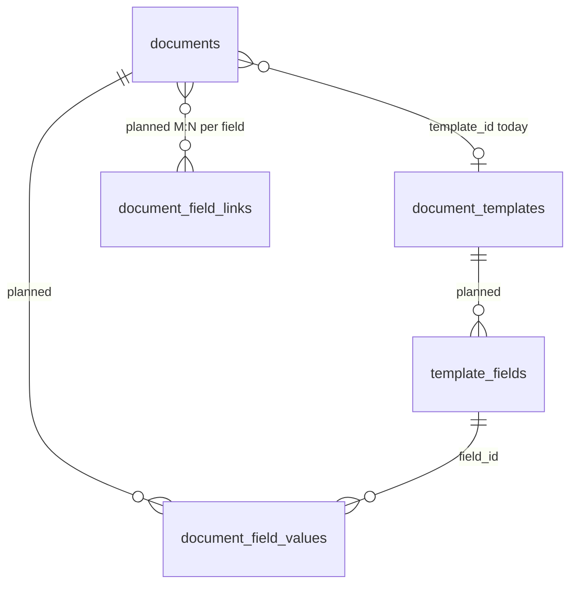

# Document template custom fields (approved design)

**Status:** Architecture approved. **Not implemented** in SQLite, IPC, or UI. The shipped schema remains **`user_version` 4** per [projectDB.md](projectDB.md) until a v5+ migration lands.

## Problem

Users define **document templates** with an open-ended set of typed fields (text, textarea, relationships, and similar). Each **document** picks one template. The GUI renders that template's fields; on save, values persist in the database and are tied to **field identities** from the template, not to column names baked into the schema.

## Design principles

1. **Stable `field_id`** — document values pair to UUID field ids, never to labels or sort order.
2. **Live template + soft-delete** — one current definition per template; fields edited in place; removed fields soft-deleted, not hard-deleted.
3. **Orphan retention** — values whose field definition is inactive stay in the database; the main form hides them.
4. **Merge at read time** — documents store values only; the app merges current active field definitions with stored values when rendering.
5. **Hybrid storage** — relational field definitions; typed rows for scalars; junction tables for M:N relationship fields.
6. **Strict rules for type changes and template reassignment** — no silent data loss or corruption.

## Layers

| Layer | Role |
|-------|------|
| **Template shell** | `document_templates` row (display name) — exists today in v4 |
| **Field definitions** | Rows per field on a template (type, label, order, config) — **planned** `template_fields` |
| **Document values** | Rows (and link tables) keyed by `document_id` + `field_id` — **planned** |
| **Orphans** | Values whose `field_id` is not in the template's **active** definition set — kept in DB, hidden from main UI |

Documents do **not** store a full copy of the template schema.

## Relationship to v4 schema

Today ([projectDB.md](projectDB.md)):

- **`document_templates`** — id, `display_name`, timestamps (name-only shell).
- **`documents.template_id`** — optional N:1 FK to a template shell.
- **`document_media`** — M:N junction pattern to mirror for relationship-type custom fields.

Custom fields extend this spine without replacing it.



## Proposed storage (hybrid relational)

Options considered: pure EAV (all text), JSON blob per document, typed EAV, and hybrid. **Chosen: hybrid** — best fit for a queryable worldbuilding database on SQLite.

| Data | Storage |
|------|---------|
| Field definitions | Relational **`template_fields`** — `template_id`, `field_type`, `display_name`, `sort_order`, `config`, soft-delete |
| Scalar values (text, number, bool, date, …) | Typed EAV: **`document_field_values`** — one row per (`document_id`, `field_id`) with typed columns (`value_text`, `value_integer`, …) and/or `value_json` for extras |
| Relationships (M:N) | Junction tables scoped by `field_id`, mirroring **`document_media`** |

**Field identity:** Every field gets a stable UUID **`field_id`**. Documents always reference that id — never field name or sort order.

### Proposed table: `template_fields` (draft)

| Column | Type | Notes |
|--------|------|--------|
| `id` | TEXT PK | UUID v4 — stable **`field_id`** |
| `template_id` | TEXT FK → `document_templates.id` | **ON DELETE RESTRICT** (see template-delete policy below) |
| `field_type` | TEXT | Enumerated type id (text, textarea, relationship, …) |
| `display_name` | TEXT | Non-empty label shown in UI |
| `sort_order` | INTEGER | Order within template form |
| `config_json` | TEXT | Type-specific config (cardinality, target entity, validation, …) |
| `deleted_at_ms` | INTEGER, nullable | Soft-delete; null = active |
| `created_at_ms`, `updated_at_ms` | INTEGER | Unix ms |

Optional future column: **`slug`** — logical name for cross-template value porting (deferred).

Indexes (draft): **`idx_template_fields_template_id`**, **`idx_template_fields_template_active`** (partial or composite including `deleted_at_ms`).

### Proposed table: `document_field_values` (draft)

| Column | Type | Notes |
|--------|------|--------|
| `document_id` | TEXT FK → `documents.id` | **ON DELETE CASCADE** |
| `field_id` | TEXT | References `template_fields.id`; **no FK** to allow orphans when definition soft-deleted or template removed |
| `value_text` | TEXT, nullable | String / textarea scalars |
| `value_integer` | INTEGER, nullable | Integer scalars |
| `value_real` | REAL, nullable | Float scalars |
| `value_integer_bool` | INTEGER, nullable | 0/1 for booleans |
| `value_json` | TEXT, nullable | Extras or complex scalar payloads |
| `updated_at_ms` | INTEGER | Last write |

PRIMARY KEY (`document_id`, `field_id`).

Index (draft): **`idx_document_field_values_field_id`** (orphan scans, template-delete checks).

### Proposed table: `document_field_links` (draft, M:N per relationship field)

| Column | Notes |
|--------|--------|
| `document_id` | FK → `documents.id` **ON DELETE CASCADE** |
| `field_id` | Relationship field identity (same orphan rules as scalars) |
| `target_id` | TEXT — id of linked entity (document, media, world, … per `config_json`) |
| PRIMARY KEY (`document_id`, `field_id`, `target_id`) | |

Additional junction tables (e.g. scoped by target type) may split from this draft during implementation if types diverge.

## How templates and documents relate

```
document_templates
    └── template_fields (definitions)
documents
    ├── template_id  →  which template drives the form
    ├── document_field_values (scalars)
    └── document_field_*_links (M:N per field)
```

- **Document → template:** N:1 via existing **`documents.template_id`**.
- **Document → values:** Values belong to the document; they are interpreted using the current template's **active** field list when rendering.

## Editable template policies (v1)

**Live template** — not versioned by default. One current definition per template; fields edited in place with soft-delete. Documents always use today's active field list for the assigned template.

**Versioned templates** (pin documents to `template_version_id`) — noted as a **future** option if users need frozen schemas. **Not** the initial choice.

### Template change → document impact

| Template change | Document / DB behavior |
|-----------------|------------------------|
| Add field | No migration; empty in GUI until user saves |
| Remove field | Soft-delete definition; values retained (orphans) |
| Rename / reorder | Definition-only; same `field_id`, values unchanged |
| Restore removed field | Clear soft-delete on same `field_id` → values visible again |
| Change field type | Risky — **block**, assign **new `field_id`**, or require **explicit user review**; never silently coerce |
| Change document's template | Values for fields not on the new template become orphans relative to new UI; switching back can surface them again |

### Template shell delete (whole template)

Today v4 **`deleteFaProjectDocumentTemplate`** hard-deletes the shell; **`documents.template_id` ON DELETE RESTRICT** blocks delete while any document still references the template.

**Planned v1 policy when `template_fields` exist:**

| Scenario | Behavior |
|----------|----------|
| Documents still reference template (`template_id`) | **Block** delete (existing RESTRICT) |
| No documents reference template, but **any** `document_field_values` or link rows still reference a `field_id` from this template (e.g. after template switches) | **Block** delete until explicit purge UX ships, **or** allow delete and leave values fully orphaned with retained value rows (implementation must pick one and enforce in persist) |
| Template deleted after policy allows | **CASCADE** or explicit delete of **`template_fields`** rows; **do not** CASCADE-delete document value rows — they become orphans keyed by `field_id` |

Document this choice in persist and IPC when Phase 1 ships.

## Orphan handling

**Orphans** = values (or links) whose `field_id` is not in the **active** definition set for the document's current template (or whose definition row is soft-deleted).

- **Do not delete** orphan rows when a field is removed from the template.
- Main form shows **only active** fields.
- Recovery via later UX (e.g. **Removed fields**, restore definition, template switch) — storage supports this without migration jobs.
- Only an explicit **purge field data** action (deferred) would remove value rows.

## Read / save flows (conceptual)

### Load document for edit

1. Load **active** `template_fields` for `documents.template_id` (`deleted_at_ms` IS NULL).
2. Load all **`document_field_values`** and link rows for `document_id`.
3. For each active field, bind `values[field_id]` or empty default.
4. Orphans exist in DB but are **not** shown on the main form unless recovery UI is added.

### Save

1. Validate against current **active** definitions (required, types, cardinality).
2. Upsert values for fields present in the payload.
3. **Do not** delete orphan rows when a field drops off the template.
4. Optional later: **`template_revision`** / etag on open to warn **template changed while you were editing**.

## Deferred / out of scope for v1

- Immutable template versioning and per-document version pins
- Full search/filter across custom fields (typed EAV + indexes support this when needed)
- GUI for orphan recovery (policy is set; UX can follow)
- Hard purge of field + all document values (separate, explicit destructive action)
- Optional **`slug`** per field for cross-template value porting

## One-line takeaway

Templates define a live, soft-deletable field catalog; documents store a persistent bag of values keyed by stable field IDs; the UI shows the current template while the database keeps orphaned values for manual recovery later.

## Implementation route

Phases are ordered for future work. Update [projectDB.md](projectDB.md) in the **same commit** as each schema/IPC phase.

### Phase 1 — Schema v5+

- **`src-electron/mainScripts/projectManagement/functions/faProjectDbSchemaDdl.ts`** — add DDL for `template_fields`, `document_field_values`, link tables, indexes.
- **`src-electron/mainScripts/projectManagement/faProjectDbMigrateWiring.ts`** — v4→v5 step; bump **`FA_PROJECT_USER_VERSION_SUPPORTED_MAX`**.
- Fold resulting tables into **`projectDB.md`**; relabel sections here from **proposed** to **implemented**.

### Phase 2 — Main persist

- New modules under **`projectDbContent/`** (e.g. `faProjectTemplateFieldsPersistWiring.ts`, `faProjectDocumentFieldValuesPersistWiring.ts`).
- All access via **`runWithFaProjectDatabaseForIpcAsync`** / **`runWithFaProjectDatabaseSync`** ([fa-project-database-access.mdc](../../.cursor/rules/fa-project-database-access.mdc)).

### Phase 3 — Validation

- Zod under **`src-electron/shared/`** (`faProjectTemplateField*Schema.ts`, `faProjectDocumentFieldValue*Schema.ts`).

### Phase 4 — IPC + preload

- **`electron-ipc-bridge.ts`** — extend **`FA_PROJECT_CONTENT_IPC`**.
- **`registerFaProjectContentIpcHandlersWiring.ts`**, **`projectContentAPI.ts`**.

### Phase 5 — Types

- **`types/I_faProject*Domain.ts`** — field defs, values, merge DTOs; import from **`app/types/...`** only.

### Phase 6 — Renderer

- Pinia + document editor: merge active defs + stored values.
- Save through action manager for unified failure toasts ([fantasia-action-manager](../../.cursor/skills/fantasia-action-manager/SKILL.md)).

### Phase 7 — Template editor UI

- Field CRUD with soft-delete; type-change guards.

### Phase 8 — Deferred UX

- Orphan recovery UI, cross-field search, version pins.

## Documentation sync discipline

When implementation begins:

1. Land schema in code → **same commit** updates **`projectDB.md`** (version ladder, tables, IPC table, module map).
2. Shrink or relabel **proposed** sections in this file; avoid duplicate DDL between this design doc and **`projectDB.md`**.
3. Update **`.cursor/rules/fa-template-custom-fields.mdc`** globs if new paths appear.
4. Add user-facing changelog only when GUI/behavior ships.

## Related docs and skills

- [projectDB.md](projectDB.md) — shipped **`.faproject`** schema (v4 today)
- [README.md](../../README.md) — project database overview
- [fantasia-template-custom-fields](../../.cursor/skills/fantasia-template-custom-fields/SKILL.md) — agent playbook
- [fantasia-sqlite-main](../../.cursor/skills/fantasia-sqlite-main/SKILL.md) — migrations and ensure-connected access
- [fantasia-worldbuilding-domain](../../.cursor/skills/fantasia-worldbuilding-domain/SKILL.md) — product vocabulary
